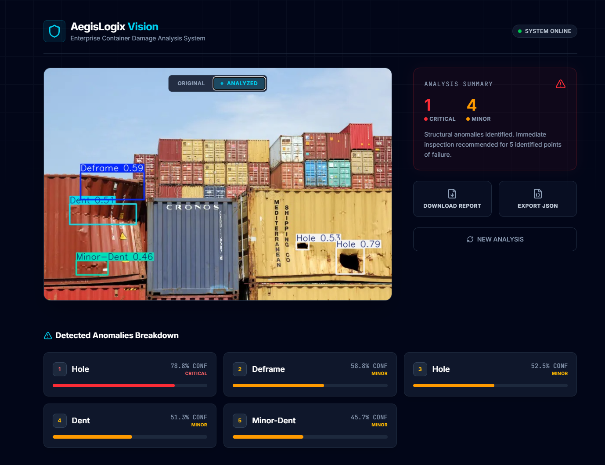

# AegisLogix




AegisLogix is a full-stack, AI-powered web application designed to detect and analyze damage in shipping containers using computer vision.

## 🧠 How it Works

**Workflow:** User Uploads Image $\rightarrow$ FastAPI translates to NumPy $\rightarrow$ YOLO ONNX performs Inference $\rightarrow$ Annotated Base64 + JSON Telemetry returned to React.

## 🚀 Features

- **AI-Powered Detection**: Leverages an Ultralytics YOLO object detection model via ONNX runtime to instantly identify container damages.
- **Interactive Dashboard**: Sleek, dark-themed React dashboard with drag-and-drop image upload capabilities.
- **Real-Time Analysis**: Quickly processes uploaded images, highlighting damaged zones with bounding boxes and confidence scores.

## 🛠️ Tech Stack

### Frontend

- **Framework**: React 19, Vite, TypeScript
- **Styling**: Tailwind CSS v4
- **Animations & Icons**: Motion (Framer Motion), Lucide React

### Backend

- **API Framework**: FastAPI, Uvicorn
- **AI / Computer Vision**: Ultralytics (YOLO), OpenCV, ONNX Runtime
- **Language**: Python

## 🏁 Getting Started

### Prerequisites

- Node.js (v18+)
- Python (3.9+)

### 1. Backend Setup

Open a terminal and navigate to the backend directory:

```bash
cd backend
```

Create and activate a virtual environment (optional but recommended):

```bash
# Windows
python -m venv .venv
.venv\Scripts\activate

# macOS/Linux
python3 -m venv .venv
source .venv/bin/activate
```

Install the required Python dependencies:

```bash
pip install -r requirements.txt
```

Start the FastAPI server:

```bash
python src/main.py
```

> The backend server will start at `http://localhost:8000` or `http://127.0.0.1:8000`.
> **Note:** If you encounter a "Connection Refused" error in the frontend, ensure the fetch URL in `Analyzer.tsx` matches the backend terminal output exactly.

### 2. Frontend Setup

Open a new terminal and navigate to the frontend directory:

```bash
cd frontend
```

Install the NPM dependencies:

```bash
npm install
```

Start the Vite development server:

```bash
npm run dev
```

> The frontend will typically start at `http://localhost:5173`. Open this URL in your browser to interact with the application.

## 📁 Project Structure

```
AegisLogix/
├── .gitignore             # Protects models and ignores large dep folders
├── backend/
│   ├── .venv/             # Python virtual environment (Not included in repo)
│   ├── models/            # Pre-trained ONNX models (Not included in repo)
│   ├── src/
│   │   ├── engine.py      # Core AI inference engine class
│   │   └── main.py        # FastAPI application and endpoints
│   ├── requirements.txt   # Python dependencies
│   └── test_images/       # Sample images for testing
└── frontend/
    ├── node_modules/      # Node dependencies (Not included in repo)
    ├── src/
    │   ├── components/    # React components (e.g., Analyzer.tsx)
    │   ├── App.tsx        # Main application layout
    │   └── main.tsx       # React entry point
    ├── package.json       # Node dependencies and scripts
    └── vite.config.ts     # Vite configuration
```

## 🔒 Security & Workflow

- Connects securely to the local backend using standard REST APIs with CORS enabled.
- Processes the image locally on the backend hardware using a lightweight `416px` inference size for rapid turnaround time without heavy compute requirements.

## 🗺️ Roadmap

- [ ] **Dockerization**: Containerize the AI engine for easy cloud deployment.
- [ ] **History Logging**: Integrate PostgreSQL to save scan results and timestamps.
- [ ] **OutSystems Integration**: Expose the backend as a secure REST API for low-code enterprise consumption.
- [ ] **Severity Scoring**: Categorize damages (Minor/Major) based on bounding box area.
