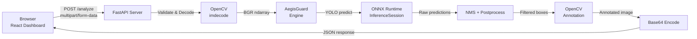

# AegisLogix

**Computer Vision-Based Shipping Container Damage Detection**


AegisLogix is an industrial computer vision and object detection deployment system designed for automated shipping container inspection. Utilizing a custom-trained YOLOv5s model compiled to ONNX, the system performs efficient inference to identify structural defects — deframe, dent, minor-dent, hole, and rust — directly from container imagery. The project implements a complete, end-to-end model deployment pipeline featuring a FastAPI backend for image validation, preprocessing, and bounding-box drawing, with a React web client serving as the visualization layer.

---

## Key Engineering Highlights

*   **Custom YOLOv5s Training**: Fine-tuned a custom YOLOv5s model, improving the detection score to a final combined mAP50 of **0.561** after identifying and resolving dataset label corruption.
*   **ONNX Deployment**: Exported PyTorch weights to ONNX format, reducing model size to **34.9 MB** and enabling deployment with only the lightweight ONNX Runtime execution engine.
*   **FastAPI Inference Pipeline**: Engineered a robust, synchronous FastAPI backend that automatically delegates CPU-bound inference execution to a background thread pool, preventing event loop blocking.
*   **Defensive API Design**: Implemented strict input checks, validation logic for corrupted files, and file size limits (≤10 MB) to prevent server-side Out-Of-Memory (OOM) crashes.
*   **Industrial Inspection Workflow**: An end-to-end computer vision system connecting image parsing, preprocessing (BGR to RGB conversion, letterboxing, and normalization), forward ONNX graph passes, Non-Maximum Suppression (NMS), coordinate mapping, and base64 rendering.

---

## Problem Statement

Container logistics networks handle massive transport volumes globally. Detecting structural damage before containers are loaded onto vessels is critical: a compromised container can lead to cargo loss, safety incidents, and delayed shipments.

Manual inspection is time-consuming and inconsistent. Inspectors visually scan containers under time pressure, often missing subtle defects like structural deframing, rust patches, holes, or minor dents that indicate deeper structural fatigue.

Computer vision offers a scalable alternative. A trained object detection model can process container images in milliseconds, consistently identifying damage categories that human inspectors may overlook, and producing structured reports for downstream logistics systems.

---

## Solution Overview

AegisLogix addresses this problem through three layers:

1. **Computer Vision Model**: A YOLOv5s model fine-tuned on labelled container damage images, detecting 5 damage classes at 416×416 inference resolution. The model is exported to ONNX format, eliminating the need for PyTorch at runtime.

2. **Inference API**: A FastAPI backend receives uploaded images, validates inputs, runs ONNX inference via the Ultralytics prediction engine, annotates the image with color-coded bounding boxes, and returns structured JSON telemetry alongside a Base64-encoded annotated image.

3. **Dashboard**: A React/TypeScript frontend with drag-and-drop upload, original/analyzed image toggling, severity breakdown cards, and animated scan visualization.

---

## Engineering Journey

This project did not follow a straight line. The model went through three distinct training stages, each driven by problems discovered in the previous stage.

### Stage 1: Initial Baseline (YOLOv8m on Kaggle Dataset)

The first attempt used a **YOLOv8m** model (~25.8M parameters) trained on the public Kaggle `container-damage-detection` dataset with 4 classes (`dent`, `hole`, `rust`, `scratch`) at 640×640 resolution for 25 epochs.

**Result**: mAP50 of **0.217**. The model missed 95% of dents (recall 0.05) and 96% of rust (recall 0.04). Training took ~50 minutes on a Tesla T4. The model was also too heavy for the target edge deployment (NVIDIA Jetson Nano).

**Decision**: Abandon the dataset, switch to a lighter architecture.

### Stage 2: Edge-Optimized Retraining (YOLOv5s on Roboflow Dataset)

Switched to **YOLOv5s** (~9.1M parameters) with a custom 5-class Roboflow dataset (`Deframe`, `Dent`, `Hole`, `Minor-Dent`, `Rust`). Reduced inference resolution to **416×416** for Jetson Nano compatibility. Trained for 50 epochs.

**Result**: mAP50 improved to **0.485**. Training completed in under 10 minutes. However, many images were being silently ignored during training.

### Stage 3: Data Surgery and Rescue

Investigation revealed two dataset bugs:
- Label directories were named `labelTxt/` instead of YOLO's expected `labels/`.
- Label files contained raw class name strings instead of integer class indices.

After writing scripts to correct the directory structure and label format, the model was retrained for 30 epochs on the cleaned dataset.

This data engineering intervention proved to be the primary driver of performance gains. The results demonstrated that dataset quality was the main bottleneck rather than the model architecture, as fixing the label and directory formats yielded a significantly higher accuracy increase than changing the model framework.

**Final Result**: mAP50 of **0.561**, mAP50-95 of **0.398**. Per-class mAP50: Dent 0.830, Hole 0.517, Deframe 0.516, Rust 0.499, Minor-Dent 0.442.

### Stage 4: ONNX Export

The best PyTorch weights from training were exported to the universal ONNX format (`best.onnx`, 34.9 MB) with a fixed input shape of `(1, 3, 416, 416)`. This ONNX model enables lightweight inference deployment, as the backend API no longer requires the PyTorch runtime to execute predictions, running the model instead through ONNX Runtime. This is the model deployed in the backend as `aegis_v1.onnx`.

> For the complete training notebook, see [`complete_model_notebook.ipynb`](./complete_model_notebook.ipynb).  
> For detailed training documentation, see [`docs/TRAINING.md`](./docs/TRAINING.md).

---

## Architecture


```mermaid
graph LR
    A["Browser<br/>React Dashboard"] -->|"POST /analyze<br/>multipart/form-data"| B["FastAPI Server"]
    B -->|"Validate & Decode"| C["OpenCV<br/>imdecode"]
    C -->|"BGR ndarray"| D["AegisGuard<br/>Engine"]
    D -->|"YOLO predict"| E["ONNX Runtime<br/>InferenceSession"]
    E -->|"Raw predictions"| F["NMS + Postprocess"]
    F -->|"Filtered boxes"| G["OpenCV<br/>Annotation"]
    G -->|"Annotated image"| H["Base64 Encode"]
    H -->|"JSON response"| A
```

### Request Flow

1. User uploads an image via the React dashboard
2. Frontend sends a `POST /analyze` request with the image as `multipart/form-data`
3. Backend validates content type, file size (≤10 MB), and decodes using OpenCV
4. `AegisGuard.scan()` runs YOLO prediction through ONNX Runtime
5. Post-processing filters detections by confidence (≥0.40), applies NMS
6. Bounding boxes are drawn on the original image with severity color coding
7. Annotated image is JPEG-compressed, Base64-encoded, and returned alongside detection metadata

> For the full architecture documentation, see [`docs/ARCHITECTURE.md`](./docs/ARCHITECTURE.md).

---

## Model Development

| Stage | Model | Dataset | Classes | Epochs | mAP50 | mAP50-95 |
|---|---|---|---|---|---|---|
| 1 | YOLOv8m | Kaggle (4 classes) | dent, hole, rust, scratch | 25 | 0.217 | 0.082 |
| 2 | YOLOv5s | Roboflow (5 classes) | Deframe, Dent, Hole, Minor-Dent, Rust | 50 | 0.485 | 0.353 |
| 3 | YOLOv5s | Roboflow (cleaned) | Deframe, Dent, Hole, Minor-Dent, Rust | 30 | **0.561** | **0.398** |

**Final model per-class metrics (Stage 3)**:

| Class | mAP50 | Precision | Recall |
|---|---|---|---|
| Dent | 0.830 | 0.701 | 0.880 |
| Hole | 0.517 | 0.884 | 0.448 |
| Deframe | 0.516 | 0.588 | 0.385 |
| Rust | 0.499 | 0.647 | 0.445 |
| Minor-Dent | 0.442 | 0.528 | 0.446 |

> For complete training documentation, see [`docs/TRAINING.md`](./docs/TRAINING.md).  
> For engineering decisions behind model choices, see [`docs/DECISIONS.md`](./docs/DECISIONS.md).

---

## Inference Pipeline

```
Upload (bytes) → Content-type & size validation → cv2.imdecode (BGR)
→ BGR→RGB conversion → Letterbox resize to 416×416
→ Normalize [0,255]→[0.0,1.0] → HWC→CHW reorder → Batch dim (1,3,416,416)
→ ONNX Runtime forward pass → Confidence filter (≥0.40) → NMS
→ Scale boxes to original dimensions → cv2 annotation (color-coded)
→ cv2.imencode (JPEG) → Base64 encode → JSON response
```

**Measured Benchmarking Speed** (Tesla T4 GPU, Google Colab):
- Preprocess: 1.3 ms
- Inference: 5.1 ms
- Postprocess: 2.8 ms
*Note: These benchmarks represent GPU execution during model testing in Colab. The deployed CPU backend runs at CPU-bound execution speeds.*

---

## Performance

The metrics below represent the actual measured performance from the model characteristics, Colab training benchmarks, and local API deployment environment. No synthetic benchmarks are used.

### Model Information
- **Model Size (ONNX)**: 34.9 MB
- **Parameter Count**: 9,113,471 parameters
- **Computational Complexity**: 23.8 GFLOPs
- **Inference Input Resolution**: 416 × 416 pixels

### Training / Benchmark Metrics
*Note: The following metrics were collected using a GPU-accelerated environment (NVIDIA Tesla T4 GPU in Google Colab) during evaluation and do not represent the CPU execution speed of the production backend.*
- **Preprocess Time**: 1.3 ms per image
- **Inference Time (GPU)**: 5.1 ms per image
- **Postprocess Time**: 2.8 ms per image

### Deployment Characteristics
*Note: The deployed backend operates on resource-constrained hosting (CPU only) with a single-worker architecture.*
- **Confidence Threshold**: 0.40
- **Execution Provider**: CPU (onnxruntime CPUExecutionProvider)
- **Memory Footprint**: ~350 MB RAM per active worker process

---

## Repository Structure

```
AegisLogix/
├── backend/
│   ├── models/                # ONNX model weights (gitignored)
│   ├── src/
│   │   ├── config.py          # Centralized configuration constants
│   │   ├── engine.py          # AegisGuard inference wrapper class
│   │   └── main.py            # FastAPI application and endpoint handlers
│   ├── test_images/           # Sample test images
│   ├── Dockerfile             # Production container configuration
│   └── requirements.txt       # Python dependencies
├── frontend/
│   ├── src/
│   │   ├── components/
│   │   │   └── Analyzer.tsx   # Main dashboard component
│   │   ├── App.tsx            # Application layout and footer
│   │   └── main.tsx           # React entry point
│   ├── .env                   # Environment variables (API URL)
│   ├── package.json           # Node.js dependencies
│   └── vite.config.ts         # Vite build configuration
├── docs/
│   ├── ARCHITECTURE.md        # System architecture documentation
│   ├── TRAINING.md            # Model training history and metrics
│   ├── DECISIONS.md           # Engineering decision log
│   └── LIMITATIONS.md         # Known limitations
├── complete_model_notebook.ipynb  # Full Colab training notebook
├── demo.png                   # Static dashboard screenshot
├── working.gif                # Animated demo
└── README.md
```

---

## Installation

### Prerequisites

- Python 3.10+
- Node.js 18+
- The ONNX model file (`aegis_v1.onnx`) placed in `backend/models/`

### Backend

```bash
cd backend
python -m venv .venv

# Windows
.venv\Scripts\activate
# macOS/Linux
source .venv/bin/activate

pip install -r requirements.txt
python -m src.main
```

The API server starts at `http://localhost:8000`.

### Frontend

```bash
cd frontend
npm install
npm run dev
```

The dashboard opens at `http://localhost:5173`.

### Docker (Backend Only)

```bash
cd backend
docker build -t aegislogix-api .
docker run -p 10000:10000 aegislogix-api
```

---

## Limitations

- **CPU-only inference**: The deployed backend uses `onnxruntime` (CPU provider). Inference is fast for single requests but does not leverage GPU acceleration.
- **Single-worker deployment**: The Dockerfile runs one Uvicorn worker to stay within 512 MB RAM limits on free-tier hosting. This means requests are processed sequentially.
- **Dataset scale**: The training dataset contains ~1,150 images across 5 classes. Production-quality detection would require a significantly larger and more diverse dataset.
- **No authentication**: The API is open. There is no user authentication or API key validation.
- **No persistence**: Scan results are returned to the client and not stored. There is no database or scan history.
- **Model accuracy**: The best mAP50 is 0.561. While sufficient for demonstration, this is below production thresholds for safety-critical inspection.

> For detailed discussion, see [`docs/LIMITATIONS.md`](./docs/LIMITATIONS.md).

---

## Future Work

- GPU inference via `onnxruntime-gpu` or TensorRT for sub-millisecond latency
- Dataset expansion with additional damage categories and diverse container types
- Scan history with database persistence
- Authentication and API rate limiting
- CI/CD pipeline with model validation tests
- Batch image processing endpoint

---

## License

MIT
