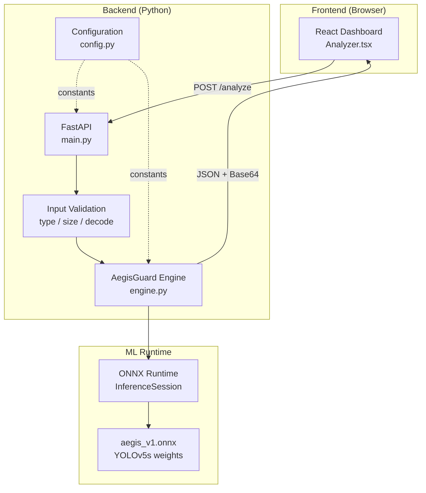
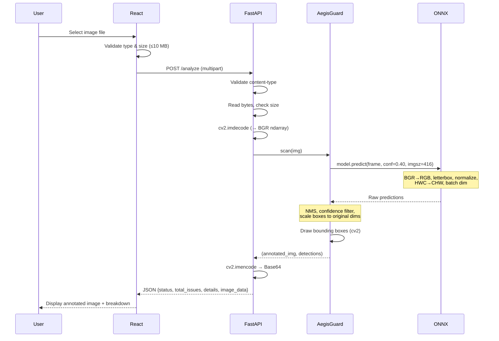

# Architecture

This document describes the system architecture of AegisLogix, explaining what each layer does and why it exists.

---

## System Overview

AegisLogix is structured as a two-tier client-server application with a shared ONNX model artifact:


Design Principles

• Keep inference isolated from the presentation layer.

• Load the model only once during application startup.

• Centralize runtime configuration.

• Validate inputs before inference.

• Keep deployment lightweight through ONNX Runtime.

---

## Backend Architecture

### Why FastAPI

FastAPI was chosen because:
- Native support for `UploadFile` with multipart form parsing, which simplifies image upload handling.
- Automatic OpenAPI documentation at `/docs`.
- Synchronous endpoint functions are automatically dispatched to a thread pool, preventing CPU-bound inference from blocking the event loop.

### Module Responsibilities

#### `config.py`
Centralizes all runtime constants. The model path is resolved dynamically via `pathlib` relative to the module file, so the server works regardless of the working directory used to launch it.

Constants managed:
- `MODEL_PATH` — resolved path to the ONNX model
- `CONFIDENCE_THRESHOLD` — minimum detection confidence (0.40)
- `INFERENCE_IMAGE_SIZE` — YOLO input resolution (416)
- `MAX_UPLOAD_SIZE_BYTES` — upload limit (10 MB)
- `ALLOWED_CONTENT_TYPES` — accepted MIME types

#### `main.py`
Defines the FastAPI application with two endpoints:

| Endpoint | Method | Purpose |
|---|---|---|
| `/analyze` | POST | Accepts image upload, runs detection, returns results |
| `/` | GET | Health check |

The `/analyze` endpoint performs validation in sequence:
1. Content-type check (reject non-image uploads)
2. File size check (reject files >10 MB)
3. Empty file check
4. Image decode check (`cv2.imdecode` failure guard)

Each validation failure returns an HTTP 400 with a descriptive error message.

The endpoint is defined as a synchronous `def` function. FastAPI automatically runs synchronous handlers in an external thread pool, which prevents the CPU-bound ONNX inference from blocking the async event loop.

#### `engine.py`
Contains the `AegisGuard` class, which wraps Ultralytics' YOLO prediction engine. It loads the ONNX model once at startup and exposes a single `scan(frame)` method.

The `scan` method:
1. Calls `model.predict()` with the configured confidence threshold and image size
2. Iterates over detected bounding boxes
3. Draws color-coded rectangles and labels on a copy of the input image
4. Returns the annotated image and a list of detection dictionaries

### Model Lifecycle

The ONNX model is loaded **once** during application startup when `AegisGuard()` is instantiated at module scope in `main.py`. The `InferenceSession` persists in memory for the lifetime of the process. There is no per-request model loading.

---

## Frontend Architecture

### Why React

The frontend is a single-page application built with React 19, TypeScript, Vite, and Tailwind CSS v4. The current UI is implemented primarily within a single Analyzer.tsx component because the application consists of a single end-to-end workflow.

### Component: `Analyzer.tsx`

The component manages the full user workflow:

1. **Upload phase**: Drag-and-drop or file picker. Validates image type and size (≤10 MB) before accepting.
2. **Preview phase**: Displays the uploaded image. User clicks "Scan Container" to trigger analysis.
3. **Loading phase**: Animated scanning overlay while the backend processes.
4. **Results phase**: Toggleable original/analyzed image view, summary card (critical vs. minor findings), and per-detection breakdown cards with confidence bars.

### API Interaction

The frontend sends a `POST` request to the backend's `/analyze` endpoint with the image as `FormData`. The API URL is read from the `VITE_API_URL` environment variable (defaults to `http://127.0.0.1:8000`).

Error handling distinguishes between:
- **Network errors** (backend offline): Shows connection error with the target URL
- **Validation errors** (HTTP 400): Parses the JSON `detail` field from the backend response and displays the specific message

---

## Request Lifecycle



---

## ONNX Inference Pipeline

The inference pipeline runs inside `AegisGuard.scan()` via the Ultralytics `YOLO.predict()` method. The following steps occur internally:

| Step | Operation | Details |
|---|---|---|
| 1 | Color conversion | BGR → RGB (ONNX model expects RGB) |
| 2 | Letterbox resize | Scale to 416×416 preserving aspect ratio, pad with gray (114,114,114) |
| 3 | Normalize | Divide by 255.0: [0,255] → [0.0,1.0] |
| 4 | Transpose | HWC → CHW dimension order |
| 5 | Batch | Add batch dimension → shape (1, 3, 416, 416) |
| 6 | ONNX forward pass | `session.run()` on the ONNX graph |
| 7 | Parse outputs | Extract box coordinates, class IDs, confidence scores |
| 8 | Confidence filter | Discard detections below 0.40 threshold |
| 9 | NMS | Remove overlapping boxes of the same class |
| 10 | Coordinate rescaling | Map boxes from 416×416 back to original image dimensions |

Steps 1–10 are handled by Ultralytics internally. The `engine.py` code then performs custom annotation (step 11) using OpenCV drawing primitives.

---

## Data Flow

```
Client                                Server
──────                                ──────
Image file (JPEG/PNG)
    │
    ├─ FormData POST ──────────────►  Raw bytes
    │                                     │
    │                                     ├─ Validation gates
    │                                     │   (type, size, decode)
    │                                     │
    │                                     ├─ BGR ndarray
    │                                     │
    │                                     ├─ ONNX inference
    │                                     │   (preprocessed tensor)
    │                                     │
    │                                     ├─ Post-processed detections
    │                                     │   [{class, conf}, ...]
    │                                     │
    │                                     ├─ Annotated BGR image
    │                                     │
    │                                     ├─ JPEG → Base64 string
    │                                     │
    ◄─ JSON response ─────────────────┘
    │
    ├─ Display annotated image
    └─ Render detection breakdown
```
