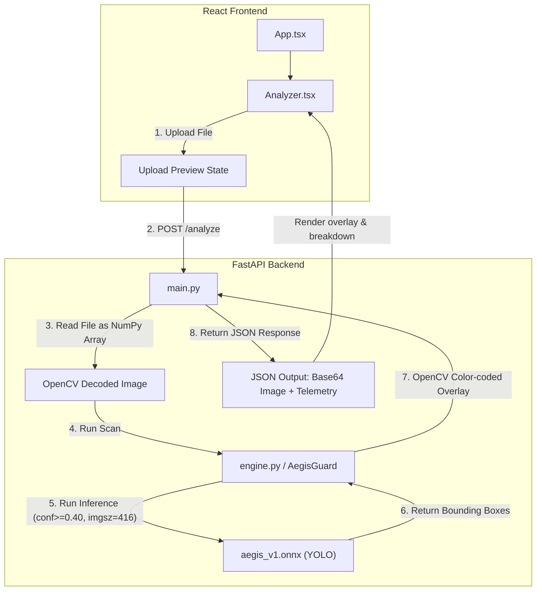

# AegisLogix: Project Overview & Guide

This document explains what the **AegisLogix** project is, its technical structure, and how to run it.

---

## 💡 What is AegisLogix? (In Simple Words)
AegisLogix is an AI-powered helper tool for shipping companies. It automatically inspects pictures of cargo containers and highlights any damage (like dents, rust, holes, or cracks).

*   **You Upload**: A photo of a shipping container.
*   **The AI Scans**: A specialized AI model inspects the image.
*   **You Receive**: The same image with boxes drawn around the damage, along with a report detailing each issue and how confident the AI is about it.

---

## 🔍 README Accuracy Check & Verification
During our inspection, we verified all requirements and startup sequences. We discovered and resolved one discrepancy:

> [!IMPORTANT]
> **Resolved Issue: Backend Launch Command**
> *   **Original instruction**: `python src/main.py`
> *   **The Problem**: Because `main.py` imports code using `from src.engine import AegisGuard`, running Python directly on the file will cause a `ModuleNotFoundError: No module named 'src'` since Python doesn't treat the parent directory as a package.
> *   **The Fix**: The command has been updated in the repository [README.md](file:///c:/Users/Karthikeya%20Dusi/Desktop/Artifacts/AegisLogix/README.md) to use module-execution: **`python -m src.main`**, which sets up the path correctly and launches the server successfully.

All other parts of the setup instructions (dependencies, Vite server, Node versions) are **100% accurate** and ready for use.

---

## 🏗️ System Architecture & Data Flow
AegisLogix is built with a decoupled frontend and backend:



---

## 🛠️ Tech Stack & Key Files

### 1. The Frontend (Website)
*   **Technology**: React 19, TypeScript, Vite, Tailwind CSS v4.
*   **Key Files**:
    *   [App.tsx](file:///c:/Users/Karthikeya%20Dusi/Desktop/Artifacts/AegisLogix/frontend/src/App.tsx): Creates the background grid layout and styles.
    *   [Analyzer.tsx](file:///c:/Users/Karthikeya%20Dusi/Desktop/Artifacts/AegisLogix/frontend/src/components/Analyzer.tsx): Contains the drag-and-drop box, the animated "neural scanning line" effect, and reports the list of critical vs. minor damages.

### 2. The Backend (AI Engine)
*   **Technology**: Python, FastAPI, ONNX Runtime, OpenCV, and Ultralytics YOLOv8.
*   **Key Files**:
    *   [main.py](file:///c:/Users/Karthikeya%20Dusi/Desktop/Artifacts/AegisLogix/backend/src/main.py): Sets up the HTTP server and API endpoints (e.g. `/analyze`).
    *   [engine.py](file:///c:/Users/Karthikeya%20Dusi/Desktop/Artifacts/AegisLogix/backend/src/engine.py): Loads the AI model and colors the bounding boxes (Red for High/Critical confidence $\ge 70\%$, Yellow for Medium/Minor confidence $40\% \le \text{conf} < 70\%$).
    *   [aegis_v1.onnx](file:///c:/Users/Karthikeya%20Dusi/Desktop/Artifacts/AegisLogix/backend/models/aegis_v1.onnx): The actual pre-trained YOLO object detection model file.

---

## 🚀 How to Run the Project (Step-by-Step)

### Step 1: Run the Backend
Open a terminal inside the project directory and run:
```powershell
cd backend
.venv\Scripts\activate
python -m src.main
```
*(The terminal will show: `Uvicorn running on http://0.0.0.0:8000`)*

### Step 2: Run the Frontend
Open a **new** terminal window and run:
```powershell
cd frontend
npm run dev
```
*(The terminal will show: `Local: http://localhost:5173/`)*

Open **`http://localhost:5173/`** in your browser to start scanning containers!
